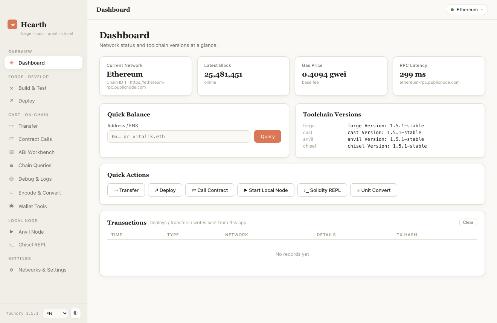
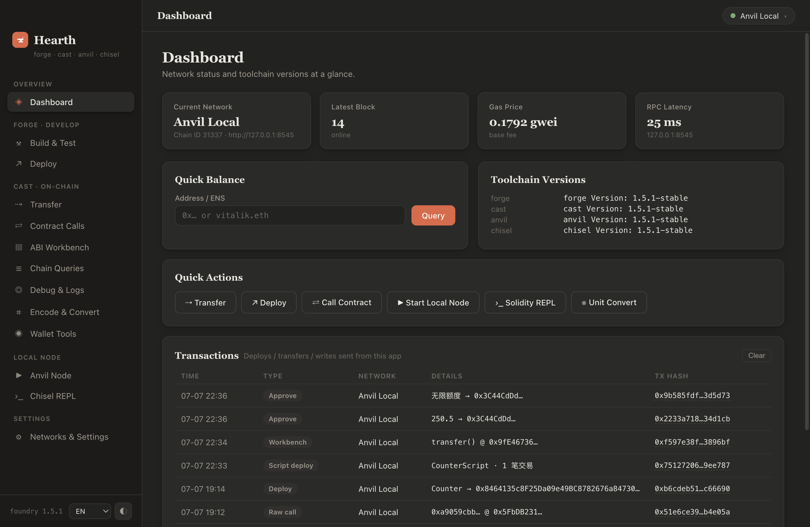

# Hearth 🔥⚒

**[Foundry](https://github.com/foundry-rs/foundry) 툴체인을 위한 따뜻하고 우아한 데스크톱 GUI.**

[English](README.md) · [中文](README.zh-CN.md) · [日本語](README.ja.md) · 한국어

Hearth는 로컬의 `forge`, `cast`, `anvil`, `chisel`을 Claude 스타일의 깔끔한 데스크톱 앱으로 감쌉니다. 컨트랙트 배포, 트랜잭션 전송, 실패 추적, 로컬 체인 실행까지 — 커맨드라인 플래그를 외울 필요가 없습니다.

<p align="center">
  
  
</p>

## 다운로드

최신 `.dmg`는 [**Releases**](https://github.com/Cafexss/hearth-foundry-gui/releases)에서 받을 수 있습니다 (Apple Silicon / Intel 지원).
앱은 서명되지 않았습니다. 첫 실행 시 앱을 우클릭해 「열기」를 선택하거나 `xattr -dr com.apple.quarantine /Applications/Hearth.app`을 실행하세요.

## 요구 사항

- [Foundry](https://getfoundry.sh) (`forge` / `cast` / `anvil` / `chisel`이 `~/.foundry/bin` 또는 PATH에 있어야 함)
- Node.js ≥ 18

## 실행

```bash
npm install
npm start
```

## 기능

| 모듈 | 설명 |
|------|------|
| **대시보드** | 실시간 네트워크 상태(블록 높이·가스 가격·RPC 지연), 툴체인 버전, 빠른 잔액 조회, 거래 내역 |
| **빌드 & 테스트** (forge) | 프로젝트 생성·열기, 원클릭 build / test / fmt / snapshot / coverage, 스트리밍 출력과 테스트 필터 |
| **배포** (forge create / script) | 단일 컨트랙트 배포(생성자 인자 자동 해석·dry-run 시뮬레이션)와 완전한 `forge script` 지원 — 시뮬레이션, 브로드캐스트, `run-latest.json`의 모든 트랜잭션 해석 |
| **ABI 워크벤치** | 프로젝트 아티팩트나 붙여넣은 JSON에서 ABI를 불러와 클릭 가능한 함수 패널 생성: 일괄 읽기, 인자 호출, 쓰기 추정·전송, payable 지원 |
| **전송** (cast send) | 네이티브 코인 전송(가스 제외 전액 버튼), decimals 자동 환산 ERC-20 전송, approve / 무제한 승인 / allowance 조회 |
| **컨트랙트 호출** (cast call / send) | 시그니처 기반 읽기·쓰기, 실제 발신자 기준 가스 추정, 미검증 컨트랙트용 Raw Calldata 모드, 원시 cast 명령 실행 |
| **체인 조회** (cast) | 잔액 / 논스 / 코드 / Tx / 영수증 / 블록 / 스토리지 슬롯 |
| **디버그 & 로그** (cast run / logs) | 트랜잭션 트레이스 재생, 시뮬레이션 추적(색상 출력), 주소·시그니처·블록 범위별 이벤트 로그 조회 |
| **인코딩 & 변환** (cast) | 단위·진수 변환, Keccak-256, 셀렉터와 이벤트 토픽, ABI 인코딩 / Calldata 디코딩, 체크섬, 4byte 역조회 |
| **지갑 도구** (cast wallet) | 지갑·니모닉 생성, 주소 유도, 메시지 서명과 검증, Keystore 가져오기와 목록 |
| **Anvil 노드** | 원클릭 로컬 체인(메인넷 포크 지원), 테스트 계정 10개를 복사 가능한 표로 자동 해석 |
| **체인 조작** (cast rpc) | 블록 채굴, 시간 이동, 상태 스냅샷·되돌리기, 임의 주소 잔액 설정, 고래 계정 impersonate |
| **멀티체인** | Ethereum / Sepolia / Base / Arbitrum / Optimism / Polygon / BSC / Anvil 내장, 커스텀 RPC, 원클릭 전환 |
| **다국어 & 테마** | 中文 / English / 日本語 / 한국어, 라이트 & 다크 테마 |

## 보안 안내

- 개인키는 로컬 `forge` / `cast` 프로세스의 인자로만 전달되며 **절대 저장되지 않습니다**. 로그에서는 자동으로 마스킹됩니다.
- 더 안전한 방법: 지갑 도구 페이지에서 `cast wallet import`로 Keystore를 가져온 뒤 계정명 + 비밀번호로 서명하세요.
- 모든 설정(네트워크, 내역, 환경설정)은 로컬 `userData` 디렉터리에 저장됩니다.

## 성능과 안정성

자식 프로세스 출력은 약 40ms 윈도우로 병합된 후 IPC를 통과하고, 렌더러는 애니메이션 프레임 단위로 DOM 쓰기를 배치 처리합니다 — 5,000줄 테스트 로그(369KB)를 약 0.5초에 렌더링, UI 끊김 없음. 설정은 디바운스 + 원자적 쓰기, 단일 인스턴스 잠금, 렌더러 충돌 자동 복구를 갖추고 있습니다.

## 크레딧

이 앱은 **Claude (Fable 5)** 가 설계·개발했습니다. Foundry는 [Paradigm / foundry-rs](https://github.com/foundry-rs/foundry)의 프로젝트입니다.

## 라이선스

[MIT](LICENSE)
